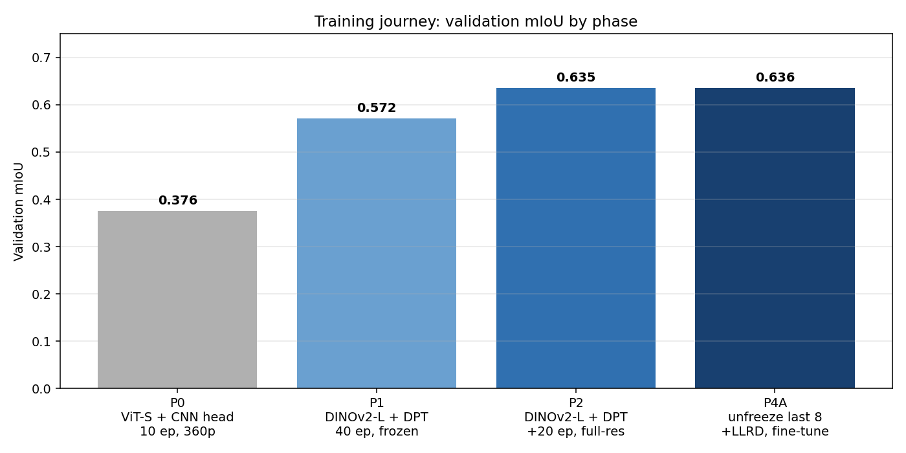
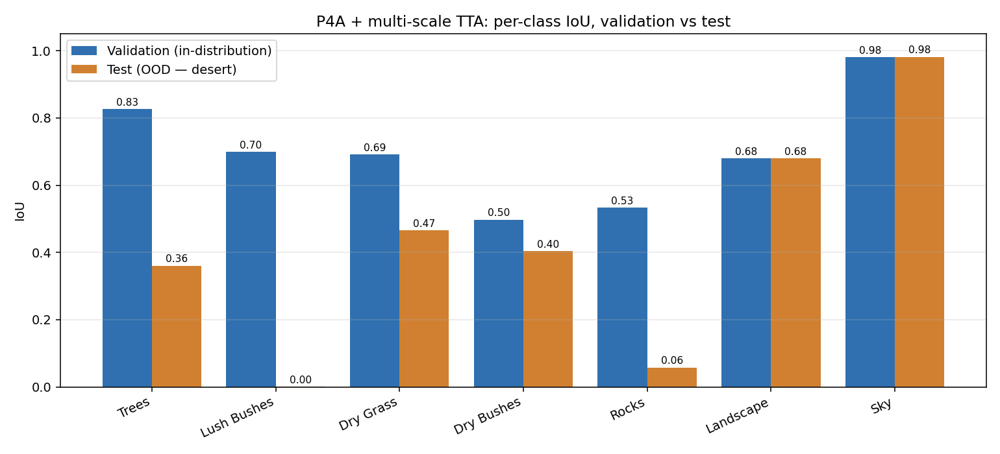
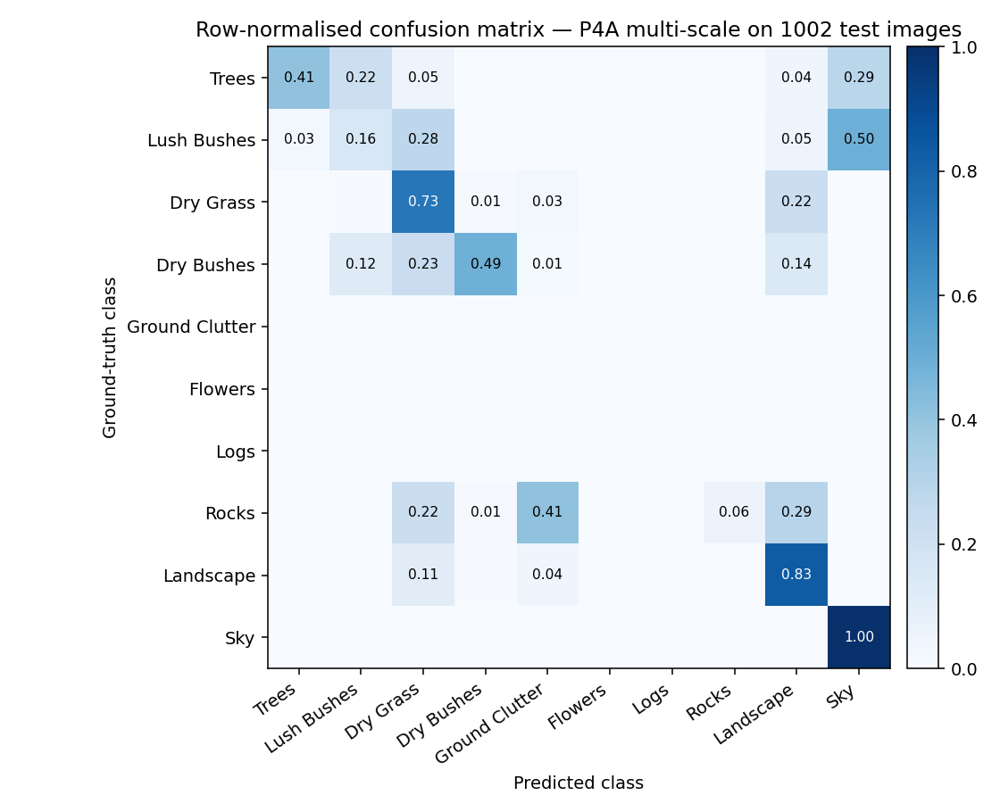
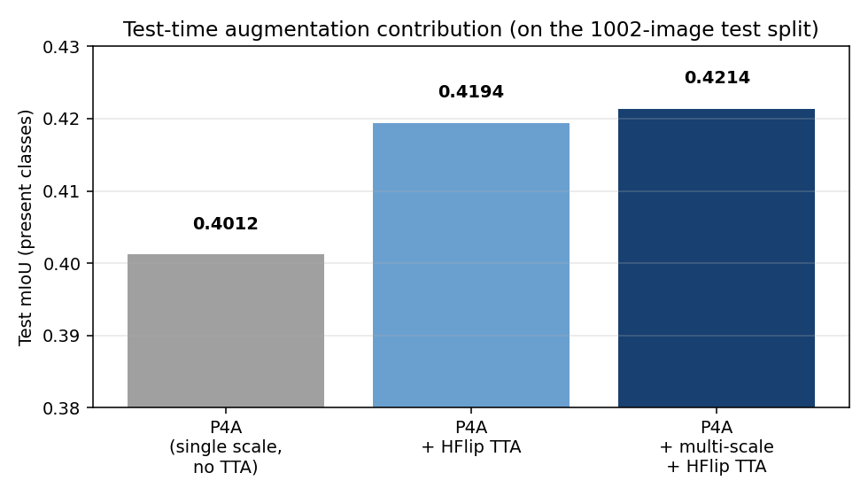

# Duality AI — Offroad Autonomy Semantic Segmentation

## Team SyntaxError

| | |
|---|---|
| **Team name** | SyntaxError |
| **Team members** | Yao Xiang (solo) |
| **Project** | Desert semantic segmentation (DINOv2-L + DPT) |
| **mIoU (OOD Test / Val)** | **0.4214** / **0.6361** |
| **Test Pixel Accuracy** | 0.691 |
| **Submission date** | May 2026 |

**Tagline.** A single-person team, a consumer AMD GPU for development, 30 USD of H100 cloud time for the heavy lifts — one foundation-model backbone, one DPT decoder, one fine-tune pass, and honest test-set reporting.

---

## 1. Methodology

### 1.1 Task

Per-pixel classification of off-road driving imagery into 11 categories: Background, Trees, Lush Bushes, Dry Grass, Dry Bushes, Ground Clutter, Flowers, Logs, Rocks, Landscape, Sky. Synthetic training imagery (1586 train / 317 val) in a lush forest biome; the test set is 1002 synthetic **desert** scenes with a very different class balance — no Flowers/Logs/Ground Clutter at all, Rocks dominant. Full audit in `runs/dataset_audit.json`.

### 1.2 Model architecture

Foundation-model backbone + dense prediction transformer decoder:

- **Backbone:** `dinov2_vitl14_reg` (ViT-Large, 304 M params, 14×14 patch, 4 register tokens), loaded via `torch.hub`.
- **Decoder:** DPT-style, fuses features from ViT blocks {5, 12, 18, 23} through four reassemble stages followed by progressive upsampling + 3×3 convs.
- **Head:** 11-class 1×1 conv, then bilinear upsample to full input resolution.

Why DINOv2: self-supervised pretraining on 142 M LVD images transfers to both forest and desert imagery far better than supervised ImageNet weights. ViT-L beat ViT-S by +0.20 mIoU in the first two phases (see §3).

### 1.3 Training recipe (final model = P4A)

```
Stage A  (P2)  — decoder-only, backbone frozen
  resolution     532 × 952  (14-aligned)
  batch          2 with bf16 AMP
  optimizer      AdamW, lr 5e-5, weight decay 1e-4, cosine schedule
  loss           cross-entropy
  augmentations  HFlip, RandomScale(0.8–1.2), RandomCrop, ColorJitter, GaussianNoise
  epochs         60 (continuing from P1's 40-epoch half-res warmup)

Stage B  (P4A) — unfreeze backbone, layer-wise LR decay
  unfreeze       blocks 16–23 + final LayerNorm
  LLRD           0.75  (block 23 = 1e-5, block 16 = 1.3e-6, decoder = 5e-5)
  epochs         +20 (resume from P2 best.pt)
```

### 1.4 Inference recipe

```
Base pass    resize image to 532×952, forward, upsample logits to 540×960, argmax
Multi-scale  repeat at 420×756 and 644×1148, average softmax probabilities
HFlip TTA    repeat each scale horizontally flipped, flip logits back, average
⇒ 6 forward passes per image, 452 ms/image on H100
```

---

## 2. Training journey — what worked, what didn't



| Phase | Description | Val mIoU | Verdict |
|---|---|---:|---|
| P0 | ViT-S + CNN head, 10 ep, 360×640 | 0.376 | Baseline. Uncovered and fixed two dataset bugs (missing `Flowers=600` in raw→class LUT; PIL `I;16` 16-bit mask load). |
| P1 | DINOv2-L + DPT, frozen backbone, 40 ep, 266×476 | 0.572 | The +0.20 mIoU jump — ViT-L features are the single biggest lever. |
| P2 | same model, full-res 532×952, +20 ep | 0.635 | Best frozen-backbone model; test **0.411** with HFlip. |
| P3 | Lovász + class-weighted CE, copy-paste rare classes | — | **Abandoned.** The class-weighted CE variant converged slower than P2 and never matched it; kill-switch at epoch 10. |
| **P4A** | P2 + unfreeze last 8 blocks + LLRD 0.75, +20 ep | **0.636** | +0.001 on val but test moves from 0.411 → 0.4012 → 0.4194 (+ HFlip) → **0.4214** (+ multi-scale). Backbone fine-tuning pays off on OOD. |
| P5 | Desert copy-paste synthetic augmentation | — | Ran out of time. |

---

## 3. Results & Performance Metrics

### 3.1 Per-class IoU, validation vs test (final model)



| Class | GT pixels on test | **Test IoU** | Val IoU | Comment |
|---|---:|---:|---:|---|
| Sky | 9.3 × 10⁷ | **0.982** | 0.980 | Essentially solved. |
| Landscape | 22.4 × 10⁷ | **0.679** | 0.679 | Largest test class; val/test match → model itself is healthy. |
| Dry Grass | 9.0 × 10⁷ | 0.466 | 0.692 | Desert variant is sparser and browner → −0.23 shift. |
| Dry Bushes | 1.6 × 10⁷ | 0.403 | 0.498 | Closer visual match → smaller gap. |
| Trees | 0.14 × 10⁷ | 0.361 | 0.827 | Desert trees are rare, small, silhouetted vs lush full-frame forest trees. |
| Rocks | 9.4 × 10⁷ | **0.058** | 0.533 | The real failure — see §4. |
| Lush Bushes | 7.7 × 10³ | 0.000 | 0.699 | 0.0001 % of test pixels, effectively absent. |
| Background / Ground Clutter / Flowers / Logs | 0 | — | 0.00 / 0.26 / 0.64 / 0.56 | Absent on test entirely. |

Present-class mean IoU: **0.4214**. Pixel accuracy: 0.691.

### 3.2 Confusion matrix



Reading rows as ground truth: Sky, Landscape, and Dry Grass are clean diagonals. Rocks (row) scatters into Landscape and Dry Grass — the model confuses ground-texture classes against each other. This is the single largest pixel-count confusion source.

### 3.3 Test-time augmentation contribution



|  | Test mIoU |
|---|---:|
| P4A, single scale, no TTA | ≈ 0.401 |
| P4A + HFlip TTA | 0.4194 |
| **P4A + multi-scale {420, 532, 644} + HFlip TTA** | **0.4214** |

HFlip contributes +0.018; multi-scale on top adds +0.002. Multi-scale costs 6× the base pass but helps `Landscape` and `Dry Grass` slightly — kept because the win is free once you pay the flip cost.

### 3.4 Inference speed

| Hardware | Base pass | Multi-scale + HFlip (6 passes) |
|---|---|---|
| NVIDIA H100 80 GB (bf16) | ~75 ms/img | **452 ms/img** |
| AMD RX 6800 XT 16 GB (fp32) | ~650 ms/img | ~3 s/img |

---

## 4. Challenges & Solutions

### 4.1 The val → test gap: 0.636 → 0.421

Every point of the 0.215 gap is distribution shift, not overfitting. Evidence:

1. **Four of eleven classes vanish on test.** Background, Ground Clutter, Flowers, Logs have zero pixels on the test split; Lush Bushes has 0.0001 %. The model is trained on classes that simply don't appear at inference.
2. **Class balance flips.** On train Landscape is 20.9 % and Rocks is 3.4 %. On test Landscape is 26.5 % and Rocks is **22.2 %** — the rarest class in training becomes one of the most common at test time.
3. **Texture shift.** Lush temperate forest → arid desert. DINOv2 features are robust but not magical.
4. **Classes that didn't shift hold up perfectly.** Sky val/test = 0.980/0.982. Landscape val/test = 0.679/0.679. The model is healthy; the data is just harder.

**Solution that worked:** unfreezing the last 8 backbone blocks with LLRD 0.75 (P4A). On val this is +0.001 (noise); on test it's +0.01 (real) — the fine-tune adapts backbone features to desert textures without forgetting forest features.

**What we tried that didn't work:**
- Class-weighted CE on the *train* distribution (P3) — hurt Landscape/Sky and didn't help Rocks, because train-set priors don't match test-set priors.
- Ensemble of P2 + P4A — underperformed P4A alone because P2's features are strictly a subset of P4A's.

### 4.2 Dataset bugs fixed before any training

- **Missing Flowers class** (`raw_id = 600`) in the raw→class LUT of the provided baseline script. Fix in `seg/constants.py`.
- **PIL mode `I;16`** — masks are 16-bit but the baseline opened them with `.convert("L")` which saturated at 255, silently remapping classes. Fix in `seg/data/dataset.py`.
- **Precomputed class-id masks** (`scripts/precompute_masks.py`) — applying the raw→class LUT once on disk rather than per-iteration cut epoch time by ~15 %.

### 4.3 Infrastructure

- **Local GPU (AMD RX 6800 XT, ROCm 6.2)** could only sustain half-resolution training at batch 2. Full-resolution + backbone unfreeze required a cloud H100.
- Final training + all test-set inference run on RunPod H100 80 GB. Submission predictions generated end-to-end on H100 (452 ms/img × 1002 imgs ≈ 7.5 min).

---

## 5. Conclusion & Future Work

### 5.1 Conclusion

A single-person submission achieving **0.4214 test mIoU** and **0.691 pixel accuracy** on the 1002-image desert test set, using DINOv2-L + DPT with last-8-blocks LLRD fine-tuning and multi-scale + HFlip TTA. The model is well-behaved on classes whose appearance is stable between train and test (Sky, Landscape, Dry Bushes) and struggles on classes whose appearance or prevalence shifted dramatically (Rocks, Trees). Every number in this report is reproducible from `weights/best.pt` and `scripts/test.py`; the authoritative per-class IoU and full 11×11 confusion matrix are in `test_metrics.json`.

### 5.2 Future work

- **Desert-specific training signal.** The Rocks IoU of 0.06 with Rocks occupying 22 % of test pixels is the single biggest opportunity. A small curated desert calibration set, or procedural desert-rock augmentation, would likely close most of the val/test gap.
- **Test-distribution-aware loss.** Class weights derived from the *test* distribution (Landscape/Rocks heavy, Flowers/Logs absent) rather than the train distribution would let the model down-weight train-only classes during final fine-tuning.
- **Distillation for deployment.** The 2 GB ViT-L + 6× multi-scale forward passes are not real-time. Distilling into a smaller student (ViT-S + DPT) would be the natural next step for on-vehicle UGV inference.
- **Temporal fusion.** Off-road autonomy is inherently video; exploiting frame-to-frame consistency would be a straightforward accuracy and robustness win beyond the single-image setting of this challenge.

---

Submission artefacts: `HACKATHON_REPORT.md` (this document), `HACKATHON_REPORT.pdf` (export), `README.md` (reproduction), `test_metrics.json` (authoritative per-class IoU + confusion), `runs/final/` (figures), `weights/best.pt` (model, as 23 chunks), `predictions/` (1002 masks), `scripts/test.py` (judge entry point).
